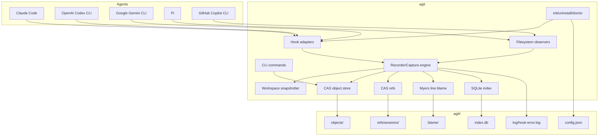

# Implementation Plan: `agit` Zig Agent VCS

## Problem statement

Build a greenfield Zig implementation of an AI-agent version-control tool inspired by `regent-vcs/re_gent`. The tool should record AI coding-agent activity as content-addressed, queryable session history: prompts, tool calls, assistant responses, workspace snapshots, per-line blame, and per-session DAG refs.

Current workspace state: `/home/mattriley/Documents/projects/personal/agengit` is not a git repository and currently contains only `research.md`. This plan is based on that research artifact and assumes implementation will begin by creating the repository scaffold.

## Confirmed product decisions

These decisions materially affect file layout, compatibility, and public API. They have been confirmed from the plan-mode clarification response.

| Decision | Confirmed value | Why |
|---|---|---|
| Binary name | `agit` | Product name is short and distinct from the Go `rgt`. |
| Store directory | `.agit/` for v1; optional `.regent/` compatibility later | Avoids silently mixing stores with Go `re_gent` until compatibility is proven. |
| Config format | `.agit/config.json` | Zig has no stdlib TOML; JSON matches Claude/Gemini/Pi config ecosystems. |
| Compatibility promise | API/behavior-compatible, not byte-compatible in v1 | Allows safe iteration without breaking existing `re_gent` users. |
| License | GNU GPL v3 | Matches Matt's default for new repos when no repo-local license exists. |
| v1 agent support | Claude Code, Codex CLI, Gemini CLI, Pi filesystem observer/RPC spike, and Copilot CLI observer | Copilot has no public lifecycle hooks, so v1 uses an observer-first path. |
| Init UI | `libvaxis` TUI in v1 | Gives the setup flow a polished first-party experience from the start. |

## Scope boundaries

### In v1

- Zig 0.16-pinned CLI with cross-platform build scaffolding.
- Content-addressed object store for blobs, trees, steps, blame maps, and refs.
- SQLite query index with schema versioning and migrations.
- Workspace snapshotting with safe default ignores and large/binary-file handling.
- Recorder/Capture engine shared by all adapters.
- Hook adapters for Claude Code, Codex CLI, and Gemini CLI.
- Pi capture through session JSONL filesystem observation, with an RPC spike before deeper integration.
- Copilot CLI capture through session-state/session-store observation.
- User CLI: `init`, `uninstall`, `doctor`, `log`, `sessions`, `status`, `show`, `blame`, `cat`, `version`, `completion`.
- Deterministic hook install/reinstall/uninstall with backups and sentinel-managed blocks.
- Unit, fixture, concurrency, and integration tests for core behavior.

### Out of v1

- Drop-in `.regent/` byte compatibility.
- Existing `vscode-regent` reuse.
- Remote sync (`push`/`pull`), GC, `fork`, `rewind`, three-way merge, and MCP server mode.
- Sophisticated inotify/kqueue file watching; start with polling for Pi/Copilot observers.

## Architecture

## Data model

- `Blob`: immutable raw bytes, addressed by BLAKE3, stored under `.agit/objects/<hash[:2]>/<hash>`.
- `Tree`: immutable sorted file entries `{path, blob_hash, mode, size, mtime?}` serialized as JSON.
- `Step`: immutable agent turn object containing parent hash, tree hash, session id, origin, turn id, causes, transcript/message refs, timestamp, and effects.
- `BlameMap`: immutable per-file line attribution for a step.
- `Ref`: mutable session pointer under `.agit/refs/sessions/<origin>:<session_id>`, advanced via CAS.
- `Index`: SQLite query projection with `schema_version`, migrations, `sessions`, `steps`, `messages`, `tool_calls`, and optional `files_changed`.

## Implementation phases

### Phase 0: Repository and ADR setup

- Create initial repo scaffold: `README.md`, `LICENSE`, `.gitignore`, `build.zig`, `build.zig.zon`, `src/main.zig`, `src/`, `tests/`, `fixtures/`, `docs/adr/`.
- Pin `minimum_zig_version = "0.16.0"`.
- Add ADRs for:
  - store directory and compatibility stance (`.agit/` v1);
  - config format (`config.json`);
  - hook process model;
  - snapshot policy;
  - hook installation/merge/uninstall contract.
- Add baseline commands: `zig build`, `zig build test`, `zig fmt --check .`.

### Phase 1: Build, packaging, and platform foundations

- Wire dependencies: `zig-clap`, `zqlite` with bundled SQLite amalgamation, optional known-folders helper.
- Avoid `@cImport`; use Zig 0.16-compatible build-system C translation/linking.
- Add CI matrix for Linux/macOS/Windows build and test.
- Prove cross-compilation to Linux musl, macOS arm64/x64, Windows x64.
- Implement executable path discovery for hook configs; store absolute path when installing hooks.
- Implement cross-platform file-lock abstraction and smoke-test it on Windows before using it for refs.

### Phase 2: Core store and index

- Implement `Store.init/open` creating `.agit/{objects,refs/sessions,blame,log}` and `index.db`.
- Implement BLAKE3 hash type, hex parsing, short-hash resolution, and content-addressed blob writes.
- Use temp-file + fsync + atomic rename semantics where available; document platform-specific fallback behavior.
- Implement `Tree`, `Step`, and object read/write with deterministic JSON serialization.
- Implement CAS refs with lock ordering:
  1. write immutable objects;
  2. open SQLite transaction in WAL mode with `busy_timeout`;
  3. acquire ref lock only for final compare-and-swap;
  4. update ref;
  5. commit index transaction;
  6. release lock.
- Add SQLite migrations and schema version table.
- Add `agit reindex` as an internal/testing command or deferred public command if needed.

### Phase 3: Snapshotting and blame

- Implement default ignore policy:
  - always ignore `.git/`, `.agit/`, dependency/build/cache directories (`node_modules/`, `target/`, `.venv/`, `dist/`, `build/`, `.cache/`);
  - ignore common secret files by default (`.env`, `.env.*`, key/cert files) unless explicitly included;
  - support `.agitignore` for project-specific rules.
- Implement snapshot walker with symlink policy, binary detection, large-file cap, and permission handling.
- Start with full snapshots plus mtime/size cache metadata for future incremental snapshots.
- Implement Myers line diff and blame-map propagation.
- Add tests covering inserted/deleted/unchanged lines, binary files, large files, symlinks, ignored paths, and secret defaults.

### Phase 4: Recorder/Capture engine

- Implement normalized structs: `SessionMeta`, `UserPrompt`, `ToolUse`, `AssistantResponse`, `Cause`, `TurnState`.
- Implement:
  - `open(cwd)`;
  - `upsertSession(meta)`;
  - `recordUserPrompt`;
  - `recordToolUse`;
  - `recordAssistantAndFinalize`.
- Ensure hook-safe error handling: adapters always exit successfully, log structured errors to `.agit/log/hook-error.log`, and never block agent execution.
- Add failure-injection tests for invalid JSON, SQLite busy, lock contention, disk write errors, and hook command crashes.
- Track hook latency in tests; set an initial target that normal no-op hooks complete quickly enough not to degrade agent UX.

### Phase 5: Agent adapters and installer

- Implement hidden hook commands:
  - `agit claude-hook user|assistant`;
  - `agit claude-tool-batch-hook`;
  - `agit codex-hook`;
  - `agit gemini-hook`;
  - `agit pi-watch` for filesystem observation;
  - `agit copilot-watch` for Copilot session-state observation.
- Adapter order:
  1. Claude Code: richest hooks and closest to `re_gent` model.
  2. Codex CLI: similar hook payload contract.
  3. Gemini CLI: hook integration plus optional stream-json support.
  4. Pi: one-day schema-verification spike, then filesystem observer; defer RPC driver unless needed.
  5. Copilot CLI: v1 session-state/session-store observer, with MCP server mode deferred.
- Implement `agit init`:
  - detects installed agents;
  - shows planned files before writing;
  - backs up existing files;
  - merges deterministic sentinel-managed blocks;
  - writes absolute hook command paths;
  - is idempotent.
- Implement `agit uninstall`:
  - removes only sentinel-managed blocks;
  - preserves user-owned settings;
  - reports drift if managed blocks were edited manually.
- Implement `agit doctor`:
  - verifies store layout;
  - verifies SQLite schema;
  - detects agent binaries;
  - verifies hook config points to the current executable.

### Phase 6: User CLI

- Implement user-facing commands with JSON output modes where practical:
  - `agit version`;
  - `agit status`;
  - `agit sessions`;
  - `agit log`;
  - `agit show <step>`;
  - `agit blame <path>[:<line>]`;
  - `agit cat <hash>`;
  - `agit completion`.
- Keep output compatible with the mental model of `re_gent`, but do not claim byte compatibility.
- Add golden-output tests for CLI text and JSON output.

### Phase 7: Integration validation and release

- Add fixtures for each agent hook payload shape and session transcript format.
- Add integration tests that simulate hook stdin payloads without requiring real agent auth.
- Add opt-in local tests for real Claude/Codex/Gemini/Pi installs.
- Add install/uninstall contract tests:
  - fresh install;
  - install over existing config;
  - user edits between installs;
  - reinstall;
  - uninstall;
  - uninstall after drift.
- Add release workflow that builds static artifacts, archives checksums, and publishes GitHub Release assets.
- Add installation docs for direct binary download and Homebrew tap setup.

## Validation strategy

| Area | Validation |
|---|---|
| Build | `zig build`, `zig build test`, cross-target release builds. |
| Formatting | `zig fmt --check .`. |
| Store | Round-trip object tests, deterministic hashes, dedup checks, corrupt-object handling. |
| Refs | Multi-thread/process CAS contention tests. |
| SQLite | Migration tests, WAL/busy-timeout tests, reindex parity tests. |
| Snapshot | Ignore policy, binary/large/symlink files, secret-file defaults, permission errors. |
| Blame | Line attribution fixtures across insert/delete/modify scenarios. |
| Hooks | Fixture payloads for Claude/Codex/Gemini/Pi/Copilot; failure-injection asserts agent-safe exit. |
| Installer | Sentinel merge/uninstall contract tests across supported config file shapes. |
| CLI | Golden text output and JSON schema tests. |
| Platform | Linux/macOS/Windows build and lock smoke tests. |

## Risks and mitigations

| Risk | Mitigation |
|---|---|
| Store compatibility confusion with `re_gent` | Use `.agit/` and explicit docs; add `.regent/` compatibility only after a dedicated migration plan. |
| Hook configs clobber user settings | Sentinel-managed deep merge, backups, drift detection, and `agit uninstall`. |
| Hook latency slows agents | Keep hook commands thin, log-and-exit on errors, add latency tests, defer expensive work where safe. |
| SQLite/ref lock races | Define lock ordering, enable WAL, set `busy_timeout`, test contention. |
| Snapshot cost in large repos | Default ignores, large-file caps, mtime/size cache, later incremental snapshots. |
| Secret capture | Default ignore common secret files, document `.agitignore`, warn during `init`. |
| Zig ecosystem churn | Pin Zig 0.16 and dependency versions; bump only through explicit migration. |
| Copilot lacks hooks | Build v1 filesystem observer against session-state/session-store data; defer MCP server mode. |
| Pi schema uncertainty | Start Pi phase with a schema-verification spike. |
| Windows path/locking differences | Resolve hook path discovery and file-lock smoke tests before core ref implementation depends on them. |

## Reviewer status

| Round | Reviewer | Verdict | Result |
|---|---|---|---|
| 1 | Rubber Duck plan critic | `REQUEST_CHANGES` | Required changes incorporated: compatibility stance, concurrency model, snapshot policy, hook install/uninstall, hook path/Windows locking. |

No approval gate was requested; the plan has been stress-tested, revised, and updated with the confirmed product decisions.

## Open assumptions and blockers

- Copilot session-store schema still needs investigation before implementing `agit copilot-watch`.
- Pi session JSONL schema and extension event names still need a short verification spike before implementing deeper Pi support.
- `.regent/` import/export or compatibility remains a future migration decision, not a v1 promise.

## Next implementation step

Begin Phase 0 by creating the repository scaffold and ADRs, then validate with the initial Zig build/test/fmt workflow.
