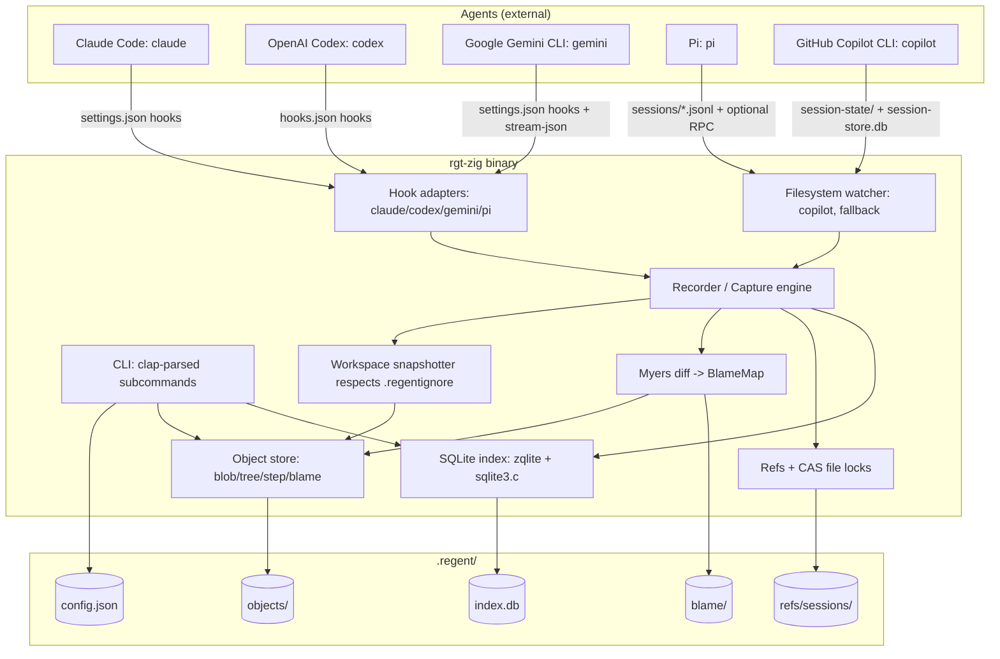

# Research: you are a senior software engineer with 25 years o

*Generated: 24/05/2026, 21:55:29*

---

# Building a Zig-based "Agent VCS" Like `re_gent` — Senior Engineering Research Report

## Executive Summary

`re_gent` (CLI: `rgt`) is a content-addressed, DAG-based "VCS for AI agents" that auto-captures every agent turn (prompt, tool call, file change, response) via lifecycle **hooks** registered into each supported coding agent. The existing implementation is written in Go and integrates with Claude Code, OpenAI Codex CLI, and OpenCode using a stable abstraction it calls a `Recorder`/`Capture` engine, with BLAKE3-hashed objects, atomic-rename writes, CAS-protected per-session refs, and a SQLite query index[^1].

Rebuilding the same product in **Zig 0.16** is feasible and arguably attractive — Zig's static cross-compiled binaries, `std.crypto.Blake3`, `std.process.spawn/run`, `std.json`, `zqlite`+SQLite amalgamation, and `libvaxis` cover every dependency the Go version relies on, often with a smaller binary and no CGO[^2]. The main risks are (a) Zig's pre-1.0 churn (0.15→0.16 was a full I/O rewrite), (b) the absence of a cross-platform file-watching library in the Zig ecosystem, and (c) the need to support **two more** agent runtimes (GitHub Copilot CLI and Google Gemini CLI), plus replace OpenCode with **Pi** (`pi.dev`, `github.com/earendil-works/pi`)[^3].

The plan that follows treats this as a 6-stage delivery: foundations (Stage 0–1), core engine (Stage 2), per-agent adapters (Stage 3), CLI surface (Stage 4), distribution (Stage 5), and hardening/roadmap (Stage 6). Each agent adapter has a defined "process wrapper → filesystem observer → hook/extension" escalation path so we can ship something useful for every target even if its hook API is weak (Copilot CLI specifically).

---

## 1. What `re_gent` Actually Is (And What We Have to Reproduce)

### 1.1 Core mental model

- A `.regent/` directory sits next to `.git/` and is **complementary**: git tracks human commits, re_gent tracks agent turns[^1].
- Each agent turn becomes a **Step** — a content-addressed object analogous to a git commit, but carrying agent-specific fields (`session_id`, `origin`, `turn_id`, `causes` (tool calls), `tree`, `transcript`, `effects`)[^1].
- Steps form a per-session DAG. The only mutable state is `refs/sessions/<origin>:<session_id>` which is advanced via compare-and-swap[^1].
- Hooks fire automatically, so users never run `rgt commit`. Zero developer ceremony[^1].
- A SQLite index (`.regent/index.db`) is the **query layer**, rebuildable from the canonical content-addressed object store[^1].

### 1.2 On-disk layout we must match (or improve on)

```
.regent/
├── objects/<hash[:2]>/<full-hash>   # sharded BLAKE3 CAS
├── refs/sessions/<origin>:<id>      # per-session mutable pointers
├── blame/<step>/<path-hash>         # sidecar per-line blame
├── index.db                         # SQLite query layer
├── config.toml                      # config
└── log/hook-error.log               # silent hook errors
```

This layout is the de-facto contract; replicating it lets a Zig rewrite be a drop-in replacement, and lets us reuse `re_gent`'s VSCode extension and Homebrew tap conceptually[^1].

### 1.3 Object model (5 object types)

| Object | Mutable | Content | Notes |
|---|---|---|---|
| `Blob` | no | raw bytes | atomic tmpfile+rename, deduped by hash[^1] |
| `Tree` | no | sorted `[]{path, blob, mode}` (JSON) | workspace snapshot[^1] |
| `Step` | no | parent(s), tree, causes, session_id, origin, turn_id, ts | the "commit"[^1] |
| `BlameMap` | no | `[]Hash` (one step per line) | computed at write-time via Myers diff[^1] |
| `Ref` | **yes** | name → step hash | CAS-protected with file lock[^1] |

### 1.4 Critical invariants

- **Hooks must never break the agent.** All errors swallowed to `.regent/log/hook-error.log`; exit 0 always[^1].
- **Idempotent init.** Re-running `rgt init` must back up existing agent hook configs and merge cleanly[^1].
- **Per-session isolation.** Sessions never conflict at the ref level; workspace conflicts are a future feature[^1].
- **Object store is canonical.** SQLite is rebuildable via a planned `rgt reindex`[^1].

---

## 2. Zig 0.16 Ecosystem Reality Check (May 2026)

### 2.1 State of the toolchain

- **Stable:** Zig 0.16.0 (released 2026-04-13). Master is 0.17.0-dev[^2].
- **Pre-1.0.** Breaking changes every minor; 0.16's "I/O as an Interface" is the largest stdlib restructuring to date[^2].
- **Pin via `minimum_zig_version` in `build.zig.zon`** to avoid surprise breakage on contributors' machines[^2].

### 2.2 Library matrix we will actually use

| Need | Library | Notes |
|---|---|---|
| CLI parsing | `Hejsil/zig-clap` 0.12.0 | Comptime DSL, subcommands via `terminating_positional`[^2] |
| TUI (init wizard, log viewer) | `rockorager/libvaxis` 0.6.0 | Only production-ready TUI; matches `huh`+Bubble Tea role in Go original[^2] |
| SQLite | `karlseguin/zqlite.zig` (master branch for 0.16) | Ergonomic, supports bundling sqlite3 amalgamation for fully static builds[^2] |
| Hashing | `std.crypto.hash.Blake3` | Already in stdlib, parity with re_gent[^2] |
| HTTP (push/pull later) | `std.http.Client` | Production-ready in 0.16[^2] |
| JSON (hook payloads) | `std.json.parseFromSlice` + Scanner | Production-ready, supports typed structs[^2] |
| TOML config | third-party (`zig-toml`) | No first-party TOML; alternative is to use JSON config (Pi/Gemini/Claude all use JSON anyway)[^2] |
| Subprocess (wrap agents, run git) | `std.process.spawn` / `std.process.run` (new in 0.16) | Clean stdio piping, `cwd_dir` support[^2] |
| File watching | **none mature** — hand-roll inotify/kqueue or poll | Reference: `oven-sh/bun:src/watcher/Watcher.zig`[^2] |
| Cross-compile | first-party `zig build -Dtarget=...` | Single static binary per target[^2] |
| Process IPC | stdio + `std.Io` reader/writer | For RPC mode (Pi) and stream-json (Gemini/Claude)[^2] |

### 2.3 Specific Zig pitfalls we must plan for

1. **`@cImport` is deprecated in 0.16** — for any C interop (sqlite amalgamation, optional libgit2) use `b.addTranslateC` in `build.zig`[^2].
2. **`std.Io` is required for every blocking call** in 0.16. Functions must take `Io` as a parameter; this is the right pattern but it ripples through every API[^2].
3. **No stdlib file watching.** Decision below.
4. **No TOML in stdlib.** Use JSON for `.regent/config.toml`-equivalent (rename to `.regent/config.json`), or pull in `zig-toml`. JSON is the pragmatic call[^2].
5. **Library version pinning matters** — clap 0.12 ↔ Zig 0.16; using the wrong combo fails to compile[^2].

### 2.4 Distribution wins this gives us over Go

- A single static binary per target (`x86_64-linux-musl`, `aarch64-linux-musl`, `aarch64-macos`, `x86_64-macos`, `x86_64-windows-gnu`, `aarch64-windows-gnu`) built from one machine with one command per target[^2].
- No CGO, no glibc floor, ~1–5MB typical CLI binary[^2].
- Bundled sqlite3 amalgamation via `addCSourceFile`[^2].

---

## 3. Agent Integration Surface (The Real Work)

For each agent we have **three escalating integration paths**[^3]:

1. **Process wrapper** — spawn the agent CLI ourselves, capture stdout/stderr.
2. **Filesystem observer** — watch the agent's own session files.
3. **Hook/extension** — register a hook or extension owned by the agent.

We will prefer (3) when available because it gives us synchronous, structured payloads. (2) is the universal fallback. (1) is rarely the right primary path because users expect to keep running the agent themselves.

### 3.1 Per-agent capabilities (verified)

| Agent | Binary | Config dir | Hook system | Session files | Preferred path |
|---|---|---|---|---|---|
| **Claude Code** | `claude` | `~/.claude/` | **Yes — 28+ events**, types: command/http/mcp_tool/prompt/agent[^3] | `~/.claude/projects/<hash>/<uuid>.jsonl` live-written[^3] | Hook (rich) |
| **OpenAI Codex CLI** | `codex` | `~/.codex/` | **Yes — 10 events** (SessionStart, PreToolUse, PostToolUse, Stop, SubagentStart/Stop, PreCompact/PostCompact, PermissionRequest, UserPromptSubmit)[^3] | `~/.codex/` rollout files (`log_dir` overridable); `transcript_path` in hook stdin[^3] | Hook |
| **Google Gemini CLI** | `gemini` | `~/.gemini/` | **Yes — 11 events**, deepest LLM-level intercept (`BeforeModel`, `AfterModel`)[^3] | `~/.gemini/tmp/<project>/<session-id>/`; JSONL stream via `--output-format stream-json`[^3] | Hook + stream-json |
| **Pi** | `pi` | `~/.pi/agent/` | **TypeScript extension API** + **full RPC mode** (`pi --mode rpc`) — `prompt`, `steer`, `follow_up`, `get_state`, `get_messages`, `abort`[^3] | `~/.pi/agent/sessions/` JSONL **tree-structured** (id+parentId for branching)[^3] | Filesystem observer (simplest) or RPC if we drive `pi` |
| **GitHub Copilot CLI** | `copilot` | `~/.copilot/` | **None** (no documented lifecycle hooks)[^3] | `~/.copilot/session-state/` per-session files + `~/.copilot/session-store.db` SQLite[^3] | Filesystem observer + MCP server (only escape hatch) |

### 3.2 Common hook payload contract

Claude Code, Codex CLI, and Gemini CLI all pass a similar JSON payload to a hook command on stdin[^3]:

```json
{
  "session_id": "...",
  "transcript_path": "/abs/path/to/session.jsonl",
  "cwd": "/project/root",
  "hook_event_name": "PreToolUse|PostToolUse|Stop|UserPromptSubmit|...",
  "model": "...",
  "permission_mode": "...",
  "turn_id": "..."
}
```

For tool events, also: `tool_name`, `tool_input`, `tool_use_id`, `tool_response`.

This near-uniformity is why `re_gent` has one `Recorder` shared by every adapter — the per-CLI hook commands are thin shims that normalise into one in-process API[^1]. **Our Zig design must preserve this shape.**

### 3.3 The Copilot CLI problem

Copilot CLI is the odd one out — no public lifecycle hook system. Two viable strategies[^3]:

- **A. Filesystem observer.** Watch `~/.copilot/session-state/` and read `~/.copilot/session-store.db` (SQLite) for per-turn data. Requires file watching (Stage 2c work).
- **B. MCP server.** Register a `regent-mcp` server in `~/.copilot/mcp-config.json`. Copilot will call our tools during the session — not a hook, but gives us a guaranteed call-out per turn that we can use to flush state.

**Recommendation:** ship A first (universal pattern, also benefits Pi). Ship B in stage 6 as a quality-of-life add. Document the limitation in the README.

### 3.4 Pi-specific opportunity

Pi's `--mode rpc` is the richest programmatic surface of all five agents — full JSON protocol over stdio with `steer`, `follow_up`, `get_messages`, `abort`[^3]. If we ever want **`rgt rewind`** to also coordinate with the live agent (so the user can travel back in time *and* tell the agent "we're now at step X"), Pi is where to prototype it. For Stage 3 capture, however, the filesystem observer on `~/.pi/agent/sessions/` JSONL files is plenty.

---

## 4. High-Level Architecture (Zig Port)



The dotted contract: every adapter normalises into the same `Recorder` API:

- `recorder.upsertSession(meta)`
- `recorder.recordUserPrompt(p)`
- `recorder.recordToolUse(t)`
- `recorder.recordAssistantAndFinalize(r)` — **this is the call that takes the workspace snapshot, computes blame, writes the Step, and advances the ref via CAS**.

This is the exact shape `re_gent` settled on (`internal/capture/capture.go`)[^1] and there is no reason to deviate.

---

## 5. Staged Delivery Plan

### Stage 0 — Pre-work and decisions (1–2 days)

**Goal:** Lock decisions before any code lands.

- ✅ Confirm Zig version target: **0.16.0** (pin via `minimum_zig_version`)[^2].
- ✅ Pick license — repo-policy default GNU GPL v3 (per user-level convention).
- ✅ Decide config format: **JSON** (no first-party TOML in Zig; matches Claude/Gemini/Pi anyway). Note this **diverges** from `re_gent`'s `config.toml`.
- ✅ Decide CAS hash: **BLAKE3** for parity with `re_gent`[^1]. `std.crypto.hash.Blake3` is in stdlib[^2].
- ✅ Decide binary name. Recommendation: **`zgt`** (or `rgt-zig` if we want to coexist with the Go binary during dual-install testing). Default: `zgt`.
- ✅ Decide what we **don't** clone in v1: subagent secondary-parent linking, `rgt fork`/`rgt rewind`, `rgt push/pull`, GC, three-way merge — all are Phase 3–6 in `re_gent`'s own roadmap and remain unresolved there[^1].
- ✅ Scope target agents for v1.0 — Claude Code, Codex CLI, Gemini CLI, Pi. **Copilot CLI deferred to v1.1** because its lack of hooks pushes us into Stage 2c earlier than needed.

### Stage 1 — Foundations (Week 1)

**Goal:** Cargo-cult-free `build.zig`, dependency wiring, smoke tests.

- `build.zig` + `build.zig.zon` with: `clap`, `vaxis`, `zqlite`, bundled `sqlite3.c` amalgamation, optional `known-folders`[^2].
- Target list in build: `x86_64-linux-musl`, `aarch64-linux-musl`, `aarch64-macos`, `x86_64-macos`, `x86_64-windows-gnu`[^2].
- `zgt version` end-to-end (proves the toolchain works).
- CI: build on Linux/macOS/Windows runners; run `zig fmt --check`, unit tests, static cross-compile matrix.
- ADR-style docs/`design/` directory inside the repo for major decisions (CAS hash, config format, hook contract).

### Stage 2 — Core engine (Weeks 2–4)

**2a. Object store + CAS** (the heart):

- `Store.init(root)` / `Store.open(root)` creating `.regent/{objects,refs,blame,log}` + `index.db`[^1].
- `writeBlob(bytes) -> Hash` — `BLAKE3` over content; shard `<hex[:2]>/<hex>`; tmpfile + fsync + rename; chmod 0444; idempotent if object exists[^1].
- `writeTree(entries)` — sort by path, JSON serialise, treat as blob[^1].
- `writeStep(step)` — JSON serialise Step record with `parent`, `tree`, `causes`, `session_id`, `origin`, `turn_id`, `ts`[^1].
- `readBlob/Tree/Step(hash)` + short-hash resolution (`normalizeStepHash`)[^1].
- **Test:** round-trip 10k blobs, verify dedup via `std.fs` inode count, verify content reproducibility.

**2b. Refs with CAS + file lock**:

- `refs/sessions/<origin>:<id>` plain files containing a hex hash.
- `updateRef(name, expectedOld, new)` — acquire `O_CREAT|O_EXCL` lock file, read current, compare, write new, release lock[^1].
- `updateRefWithRetry` — 8 attempts, exponential backoff 5ms→100ms with jitter, surfacing `error.RefConflict`[^1].
- **Test:** spawn N threads doing CAS updates against the same ref; verify only the expected count of `(old, new)` pairs succeed.

**2c. Workspace snapshot + Myers blame**:

- `snapshot(cwd) -> Tree` walking the workspace, respecting `.regentignore` (port `sabhiram/go-gitignore` semantics — write a small Zig matcher or vendor one), enforcing per-file size limit (10MB default per `re_gent`)[^1].
- `computeBlame(oldTree, oldBlame, newTree, stepHash) -> map<pathHash, BlameMap>` using Myers diff at the line level; changed/inserted lines get `stepHash`, unchanged lines inherit `oldBlame[i]`[^1].
- Persist `BlameMap` as JSON blobs under `blame/<step>/<sha256(path)[:16]>`[^1].
- **Test:** edit a file, snapshot, edit again, snapshot, verify blame per line resolves to correct step.

**2d. SQLite index**:

- Schema: `sessions(id, origin, model, started_at, last_step_hash)`, `steps(hash, session_id, parent, turn_id, ts, tool_name)`, `messages(step_hash, role, content, tool_use_id, tool_response_id, idx)`[^1].
- `indexStep(step, messages)` inside one transaction (atomicity with the object write is acceptable to be best-effort because the object store is canonical and we will ship `zgt reindex` in Stage 6)[^1].
- Read APIs: `listSteps`, `sessionHead`, `getMessagesForStep`, `listHeadedSessions`[^1].

**2e. Capture engine (Recorder)** — the central orchestrator:

```zig
pub const Recorder = struct {
    store: *Store,
    index: *Index,
    snapshotter: *Snapshotter,
    // Per-session in-memory state
    currentTurn: ?TurnState,

    pub fn open(io: Io, gpa: Allocator, cwd: Dir) !Recorder { ... }
    pub fn upsertSession(self: *Recorder, meta: SessionMeta) !void { ... }
    pub fn recordUserPrompt(self: *Recorder, p: UserPrompt) !void { ... }
    pub fn recordToolUse(self: *Recorder, t: ToolUse) !void { ... }
    pub fn recordAssistantAndFinalize(self: *Recorder, r: AssistantResponse) !void { ... }
};
```

`recordAssistantAndFinalize` is the seam where snapshot + blame + step write + ref CAS happen together[^1].

### Stage 3 — Agent adapters (Weeks 4–6, partly parallel with Stage 2)

Each adapter is **one hidden CLI subcommand** of `zgt` that reads hook stdin JSON, normalises into `Recorder` calls, swallows errors to `log/hook-error.log`, and exits 0[^1].

- **3a. Claude Code adapter** — `zgt claude-hook user|assistant`, `zgt tool-batch-hook`. Installed by writing `.claude/settings.json` hooks for `UserPromptSubmit`, `Stop`, `PostToolBatch`[^1][^3]. **First** because the contract is the most stable and rich.
- **3b. Codex CLI adapter** — `zgt codex-hook`. One command, dispatch on `hook_event_name`. Install into `~/.codex/hooks.json` or `.codex/hooks.json`[^3].
- **3c. Gemini CLI adapter** — `zgt gemini-hook`. Use `BeforeTool`/`AfterTool`/`AfterAgent`/`SessionStart`/`SessionEnd` events from `~/.gemini/settings.json`[^3]. Optionally also consume `stream-json` if we drive `gemini` ourselves.
- **3d. Pi adapter (filesystem-first)** — `zgt pi-watch <session-dir>` background mode that tails `~/.pi/agent/sessions/<cwd>/*.jsonl`, parses tree-structured JSONL (id + parentId)[^3], drives `Recorder`. Optional stretch: `zgt pi-rpc` that spawns `pi --mode rpc` and acts as a richer driver.
- **3e. Copilot CLI adapter** — deferred to v1.1. Path: `zgt copilot-watch` over `~/.copilot/session-state/` + `session-store.db`. Confirm DB schema before scoping[^3].

For each adapter, ship an **integration test** that runs the real agent (where the CI permits) in a `--print`-style mode and verifies a Step is recorded.

### Stage 4 — CLI surface (Weeks 6–7)

Mirror `re_gent`'s commands (users will compare):

| Command | Notes |
|---|---|
| `zgt init` | Interactive `libvaxis`-based TUI (replaces `huh`)[^1][^2]. Detects which agents are installed, backs up existing hook configs to `.bak`, writes hooks. Idempotent. |
| `zgt log [session-id]` | `--session`, `-n`, `--json`, `--graph`, `--oneline`, `--stat`, `--conversation-only`, `--files-only`[^1] |
| `zgt sessions` | List sessions w/ step count + last activity[^1] |
| `zgt status` | Repo state[^1] |
| `zgt show <step>` | Metadata, causes, tool args/results, conversation[^1] |
| `zgt blame <path>[:<line>]` | `--session`[^1] |
| `zgt cat <hash>` | Inspect raw object[^1] |
| `zgt version`, `zgt completion bash\|zsh\|fish` | Standard plumbing |
| `zgt reindex` *(Stage 6)* | Rebuild SQLite from objects[^1] |

CLI parsing via `zig-clap` with `terminating_positional` for subcommand dispatch[^2].

### Stage 5 — Distribution (Week 7)

- GoReleaser equivalent for Zig: a `release.yml` GitHub Actions workflow that loops over targets, runs `zig build -Dtarget=... -Doptimize=ReleaseSafe`, packages tarballs, signs them, uploads to a Release[^2].
- Homebrew tap (a `homebrew-zgt` repo mirroring `regent-vcs/homebrew-tap`).
- `curl | sh` install script that detects platform and pulls the right tarball.
- Single static binary per target, ~1–5MB[^2].

### Stage 6 — Hardening / Roadmap (Week 8+)

- `zgt reindex` (rebuild SQLite from `objects/`)[^1].
- `zgt fsck` (object integrity, ref reachability).
- `zgt gc` with grace period[^1].
- Copilot CLI adapter (Stage 3e).
- Optional: MCP server mode (`zgt mcp-server`) so Copilot — and any MCP client — gets a per-turn callout into us, working around its missing hooks[^3].
- Optional: VSCode extension parity (the existing `regent-vcs/vscode-regent` could potentially be reused if our on-disk layout is byte-compatible)[^1].
- Stretch: `zgt fork <step>` and `zgt rewind <step>` (these remain in-progress in `re_gent` itself — be honest in docs)[^1].

---

## 6. Risk Register (And Mitigations)

| Risk | Likelihood | Impact | Mitigation |
|---|---|---|---|
| Zig 0.17 breaks our deps mid-development | High | Medium | Pin `minimum_zig_version` to 0.16.0; track ecosystem (clap, vaxis, zqlite) for 0.17 branches before bumping[^2] |
| No cross-platform file watcher | Certain | Medium | Start with mtime polling for Pi/Copilot watchers; add inotify/kqueue later, modelled on `bun/src/watcher`[^2] |
| Copilot CLI hook story shifts | Medium | Low | Filesystem observer is robust to API gaps; MCP server is a separate fallback[^3] |
| Pi's TS extension API event names not yet verified | Low | Low | Stage 3d uses filesystem observer, which is independent of extension API[^3] |
| BLAKE3 implementation perf gap vs Go's `lukechampine.com/blake3` | Low | Low | `std.crypto.hash.Blake3` is competitive; benchmark on real workspaces during Stage 2a[^2] |
| SQLite via amalgamation increases binary size | Certain | Low | Accept ~1MB cost; this is the price of pure Zig + static binary[^2] |
| Sessions clash between Go `re_gent` and Zig port on same repo | Medium | High | Use a different binary name (`zgt`) and a different `.zgt/` directory by default; **don't** silently re-use `.regent/` until we've shipped a documented compatibility mode[^1] |
| Hook installation clobbers user's existing agent hooks | Medium | High | Always read existing `settings.json`/`hooks.json`, deep-merge, write `.bak`, document in `zgt init` output[^1] |
| `recordAssistantAndFinalize` races with concurrent sessions | Low | High | Per-session refs already isolate at the CAS layer; document workspace conflicts as undefined for v1.0 (same caveat as `re_gent`)[^1] |

---

## 7. Key Repositories Summary

| Repo | Role for us |
|---|---|
| [regent-vcs/re_gent](https://github.com/regent-vcs/re_gent) | The reference implementation — Go source we are porting and validating against |
| [regent-vcs/homebrew-tap](https://github.com/regent-vcs/homebrew-tap) | Distribution pattern to copy |
| [regent-vcs/vscode-regent](https://github.com/regent-vcs/vscode-regent) | Reusable IDE surface if we keep on-disk layout compatible |
| [ziglang/zig](https://github.com/ziglang/zig) | Toolchain; `src/Package/Fetch/git.zig` is the gold-standard reference for Zig-native VCS code |
| [Hejsil/zig-clap](https://github.com/Hejsil/zig-clap) | CLI parsing |
| [rockorager/libvaxis](https://github.com/rockorager/libvaxis) | TUI for `zgt init` |
| [karlseguin/zqlite.zig](https://github.com/karlseguin/zqlite.zig) | SQLite bindings |
| [oven-sh/bun](https://github.com/oven-sh/bun) | `src/watcher/Watcher.zig` reference for inotify/kqueue in Zig |
| [anthropics/claude-code](https://github.com/anthropics/claude-code) | Target agent (richest hooks)[^3] |
| [openai/codex](https://github.com/openai/codex) | Target agent (Rust impl, hooks)[^3] |
| [google-gemini/gemini-cli](https://github.com/google-gemini/gemini-cli) | Target agent (deepest LLM intercept)[^3] |
| [earendil-works/pi](https://github.com/earendil-works/pi) | Target agent (RPC + extensions); **not** a Block product[^3] |
| [github/copilot-cli](https://github.com/github/copilot-cli) | Target agent (no hooks; observer/MCP only)[^3] |

---

## 8. Confidence Assessment

| Claim | Confidence | Basis |
|---|---|---|
| `re_gent` architecture (objects, refs, Step shape, capture engine, hook contract) | **High** | Direct source-level investigation of `regent-vcs/re_gent` with file/line citations[^1] |
| Zig 0.16 stdlib + library matrix | **High** | Cross-referenced 0.16 release notes, library READMEs, and `build.zig.zon`s[^2] |
| Claude Code / Codex CLI / Gemini CLI hook surfaces | **High** | Verified against official docs (anthropic.com, developers.openai.com, geminicli.com)[^3] |
| Pi disambiguation (pi.dev = earendil-works/pi, not Block) | **High** | Verified the GitHub org and installation paths[^3] |
| GitHub Copilot CLI lacks a public lifecycle hook system | **Medium-High** | Verified absence in current docs; explicitly noted in the integration report as the agent with the fewest hook points[^3] |
| Copilot CLI session-store SQLite schema | **Low** | The path `~/.copilot/session-store.db` is documented but schema isn't; Stage 3e requires reverse-engineering[^3] |
| Pi TypeScript extension event names | **Low** | RPC commands verified, but the event-name strings for before/after tool hooks in the TS extension API were not fully verified from source[^3] |
| Codex `notify` hook config key shape | **Low** | Mentioned in docs, exact config key structure not resolved[^3] |
| Estimated effort (8 weeks single senior) | **Medium** | Based on `re_gent`'s scope being v1.0 in Go; Zig adds 10–20% for I/O API churn and missing file-watching lib |

**Assumptions made (no user input requested per autonomous workflow):**
- We treat `re_gent`'s public behaviour as the contract to match, not its on-disk byte format (we choose JSON over TOML for config, but otherwise mirror the layout).
- Target language is Zig 0.16 stable (not master) — pin via `minimum_zig_version`.
- We defer Copilot CLI to v1.1 because of hook absence; we ship the other four in v1.0.
- License defaults to **GNU GPL v3** per user-level convention; revisit if it conflicts with downstream agent licensing.

---

## Footnotes

[^1]: `regent-vcs/re_gent` deep investigation — repo structure, object model (`internal/store/{store,blob,tree,step,refs,blame,transcript,hash}.go`), capture engine (`internal/capture/capture.go`), SQLite index (`internal/index/index.go`), Claude Code hook adapter (`cmd/rgt/message_hook.go:1-130`, `cmd/rgt/tool_batch_hook.go:1-70`, `.claude/settings.json:1-25`), Codex hook adapter (`cmd/rgt/codex_hook.go:1-95`), OpenCode hook adapter (`cmd/rgt/opencode_hook.go:1-90`), interactive init (`internal/cli/init.go`), CLAUDE.md design rationale (CLAUDE.md:1-215), and ROADMAP.md.

[^2]: Zig 0.16 ecosystem report — Zig 0.16.0 release notes (ziglang.org/download/0.16.0/release-notes.html: I/O as an Interface, Networking, Process, std.crypto, Build System, Target Support), `Hejsil/zig-clap` 0.12.0 README and `build.zig.zon`, `rockorager/libvaxis` 0.6.0 README and `build.zig.zon`, `karlseguin/zqlite.zig` README, `vrischmann/zig-sqlite` README, `ziglang/zig:src/Package/Fetch/git.zig:1-20`, `oven-sh/bun:src/watcher/Watcher.zig`, `vimcraft-labs/vimcraft:src/system/git/c_api.zig`.

[^3]: AI agent CLI integration reference — verified against [docs.github.com/en/copilot/github-copilot-in-the-cli/](https://docs.github.com/en/copilot/github-copilot-in-the-cli/) and [docs.github.com/en/copilot/concepts/agents/copilot-cli/chronicle](https://docs.github.com/en/copilot/concepts/agents/copilot-cli/chronicle); [openai/codex codex-rs/README.md](https://github.com/openai/codex/blob/main/codex-rs/README.md) and [developers.openai.com/codex/hooks](https://developers.openai.com/codex/hooks) and [developers.openai.com/codex/config-basic](https://developers.openai.com/codex/config-basic); [google-gemini/gemini-cli docs/hooks/reference.md](https://github.com/google-gemini/gemini-cli/blob/main/docs/hooks/reference.md), [docs/extensions/reference.md](https://github.com/google-gemini/gemini-cli/blob/main/docs/extensions/reference.md), and [geminicli.com/docs/cli/headless](https://www.geminicli.com/docs/cli/headless); [earendil-works/pi packages/coding-agent README](https://github.com/earendil-works/pi/tree/main/packages/coding-agent) and [packages/coding-agent/docs/rpc.md](https://github.com/earendil-works/pi/blob/main/packages/coding-agent/docs/rpc.md); [docs.anthropic.com/en/docs/claude-code/hooks](https://docs.anthropic.com/en/docs/claude-code/hooks), [/settings](https://docs.anthropic.com/en/docs/claude-code/settings), [/cli-reference](https://docs.anthropic.com/en/docs/claude-code/cli-reference), [/claude-directory](https://docs.anthropic.com/en/docs/claude-code/claude-directory).
